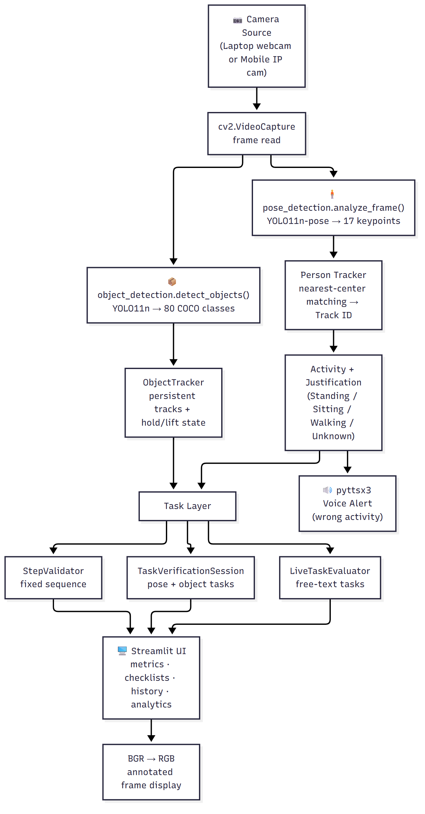
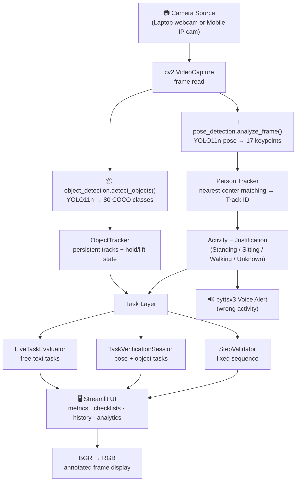
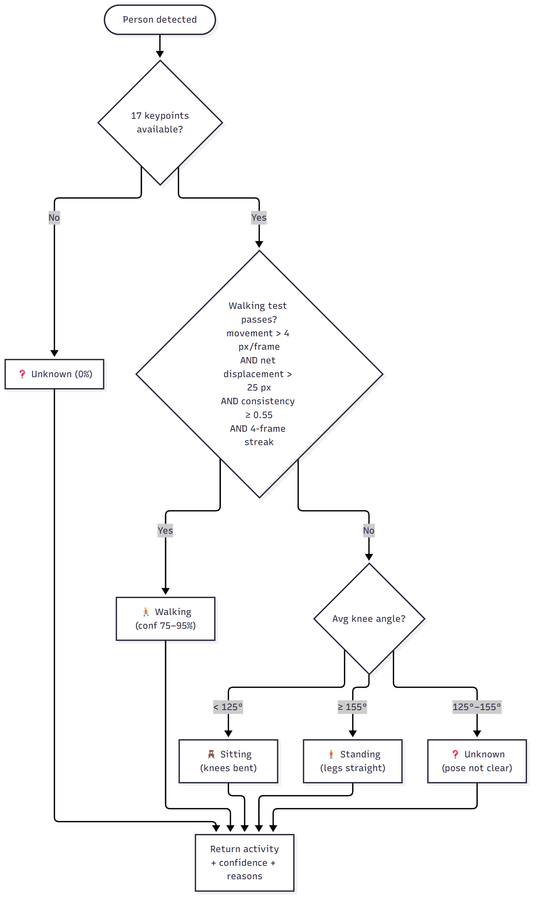
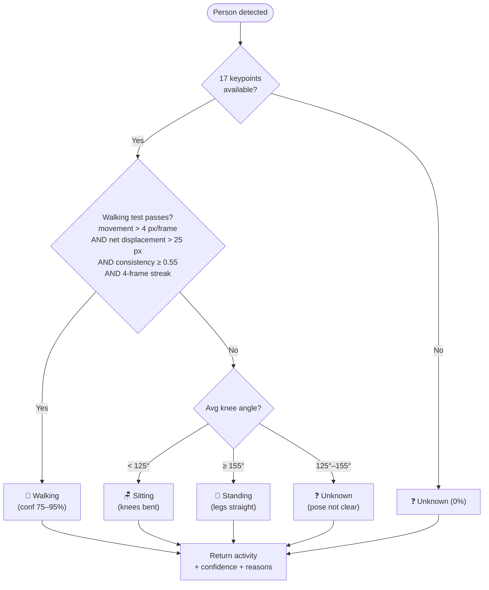
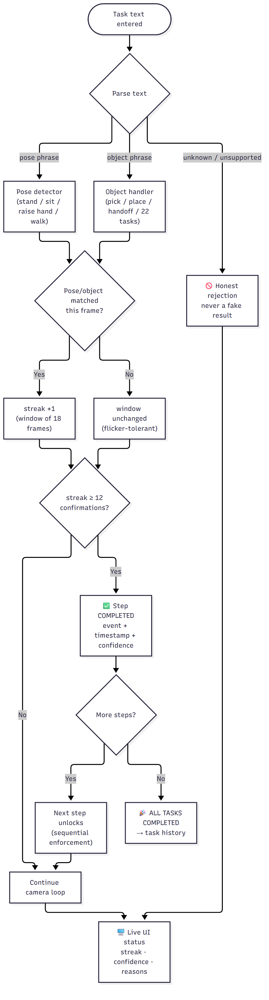
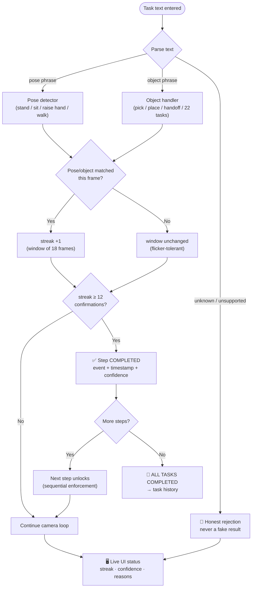
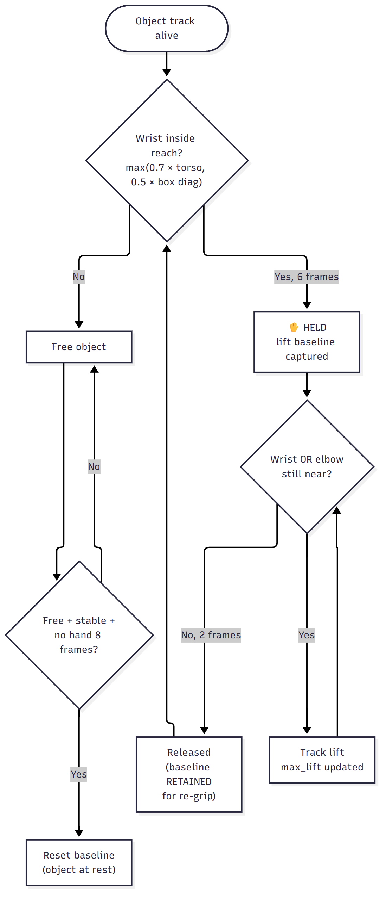
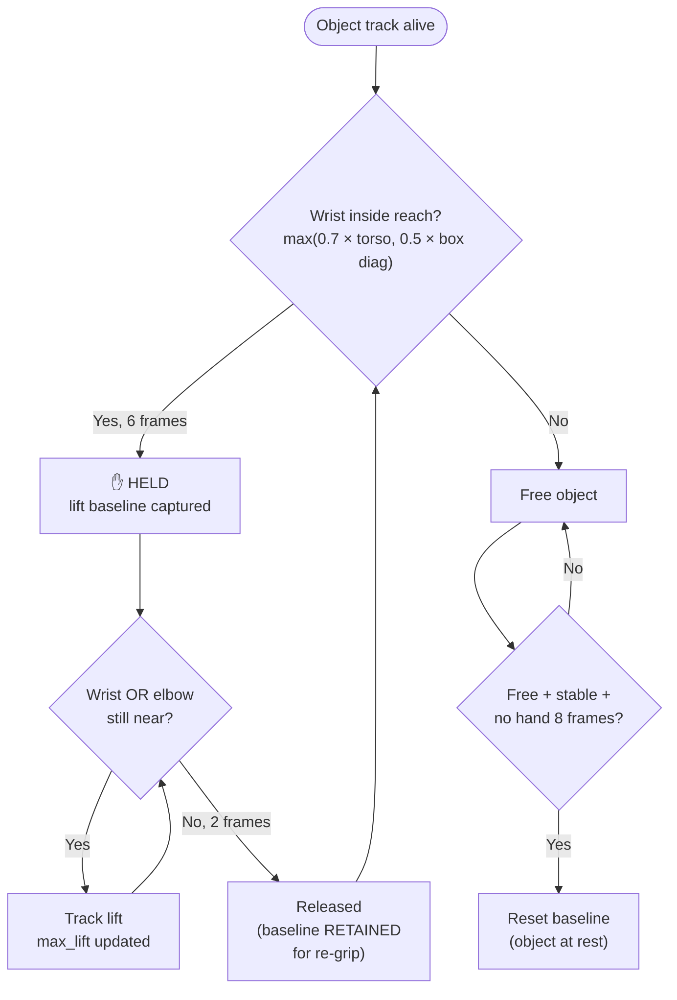
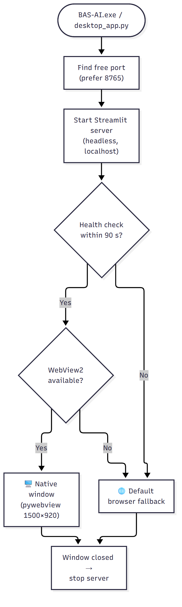
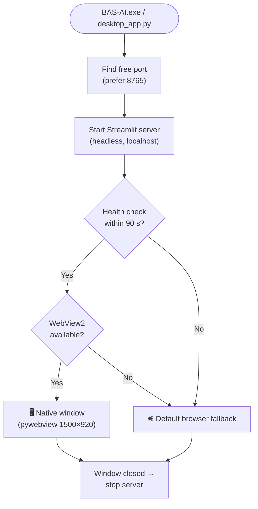

# 🗺️ BAS-AI Program Flowcharts

Visual flow of the AI-RECOGNITION-SYSTEM. These diagrams render directly on GitHub (Mermaid).

> 🖼️ **PNG exports for presentations/reports:** [`diagrams/`](diagrams/) contains all 5 diagrams as high-resolution PNGs (2× scale):
> [`01_system_pipeline.png`](diagrams/01_system_pipeline.png) · [`02_activity_classification.png`](diagrams/02_activity_classification.png) · [`03_task_state_machine.png`](diagrams/03_task_state_machine.png) · [`04_object_hold_detection.png`](diagrams/04_object_hold_detection.png) · [`05_desktop_launch.png`](diagrams/05_desktop_launch.png)
> Edit the `.mmd` sources in the same folder to change a diagram, then re-export with mermaid-cli.

---

## 1. Overall System Pipeline (every frame)

---

## 2. Activity Classification Logic (`pose_detection.py`)

---

## 3. Task Verification State Machine (`task_detection.py`)

---

## 4. Object Hold Detection (`object_tracking.py`)

---

## 5. Desktop App Launch Flow (`desktop_app.py`)

---

*Companion doc: `PROGRAM_WORKING_STEP_BY_STEP.txt` (full text analysis)*
